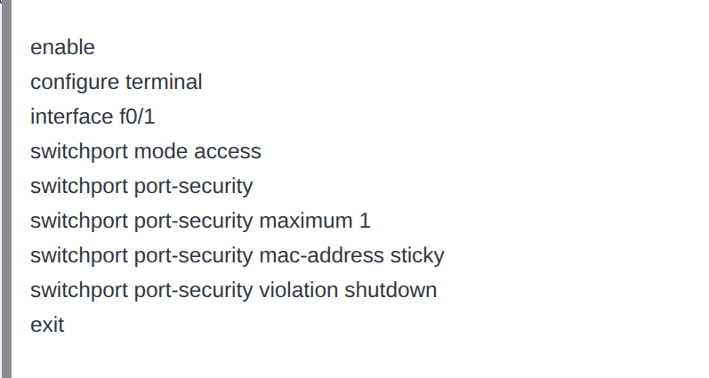
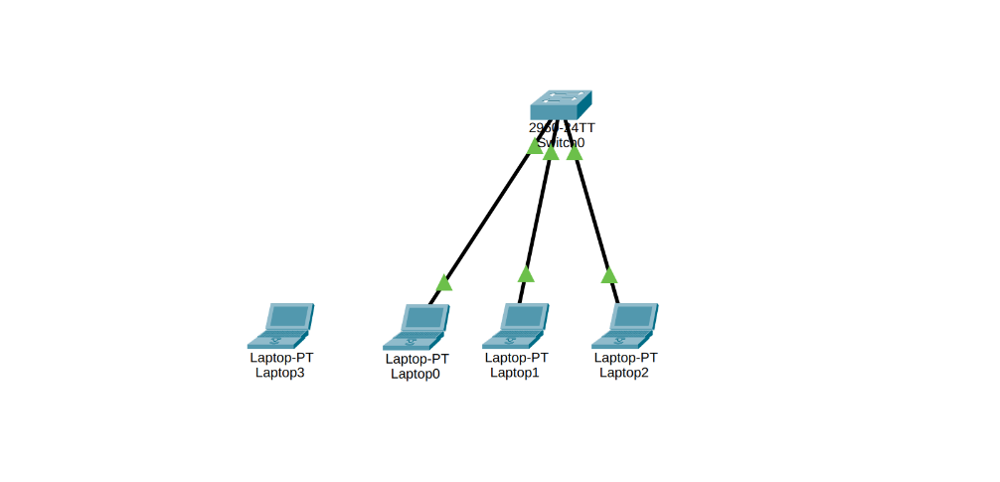
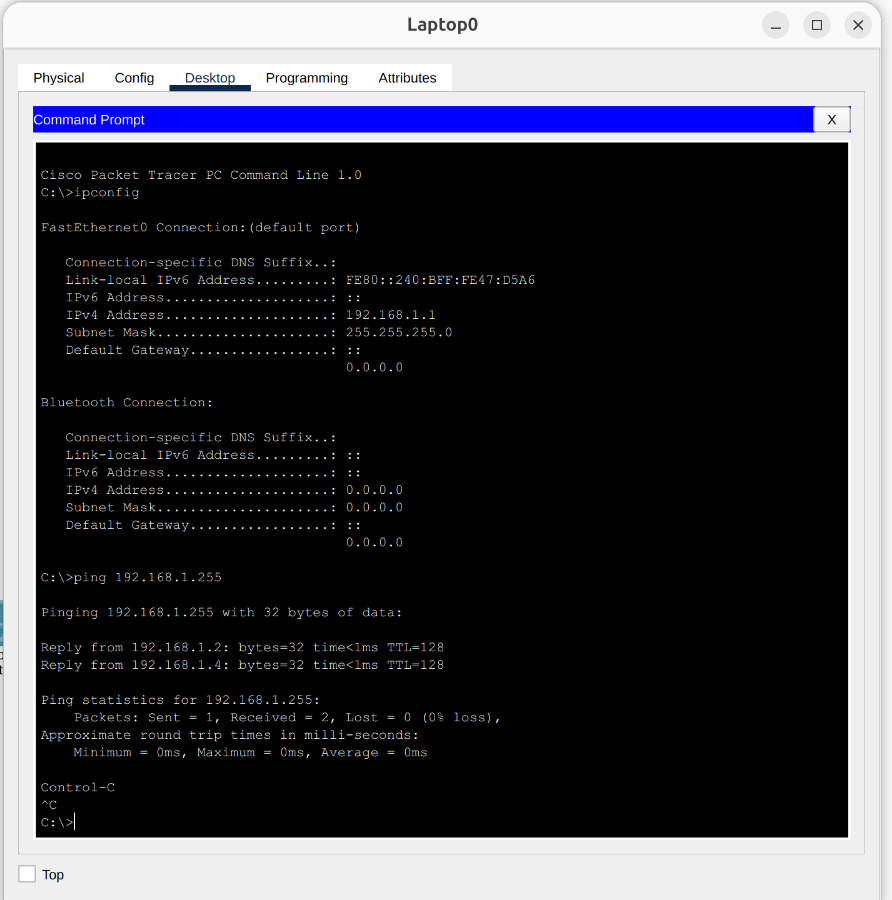
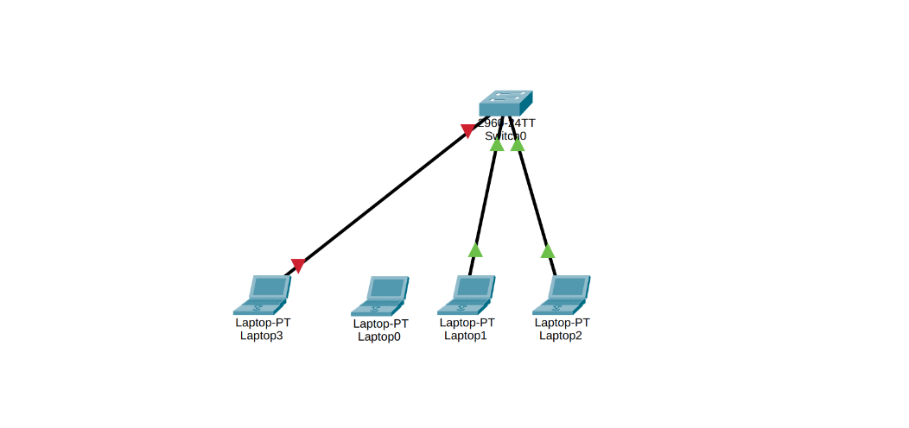
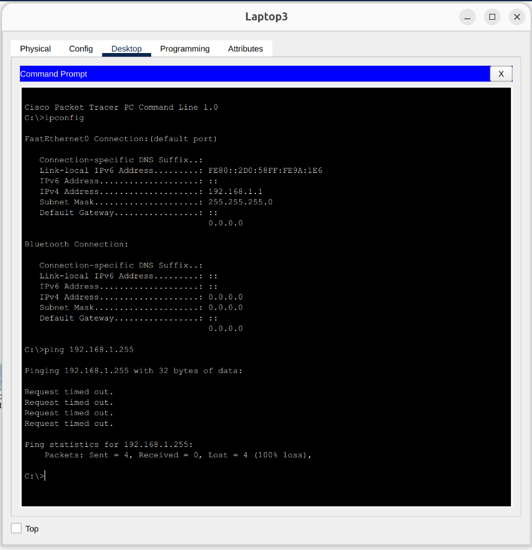

# Layer 2 Security: Switch Port Security Implementation

## 📌 Project Overview
This project demonstrates the implementation of **Switch Port Security** at Layer 2 using Cisco Packet Tracer. The objective is to restrict port access on a switch by dynamically binding it to the MAC address of an authorized device. If an unauthorized device attempts to connect to the secured port, the switch automatically detects the security violation and shuts down the interface to protect the network.

## 🏗️ Network Topology
The topology consists of a simple Local Area Network (LAN):
* **Switch:** 1x Cisco Switch acting as the central connection point.
* **End Devices:** Multiple authorized Laptops (including `Laptop0` as the baseline authorized device) and one unauthorized rogue device (`Laptop3`).
> 

## ⚙️ Security Configuration (Port Security)
Port security was configured specifically on interface **FastEthernet 0/1**. The configuration forces the port to learn the MAC address of the first connected device and lock it in.

* **Mode:** The port was manually set to `access` mode.
* **Maximum MAC Addresses:** Restricted to `1` MAC address per port.
* **MAC Address Learning:** Configured as `sticky`, allowing the switch to dynamically learn the authorized MAC address and save it to the running configuration.
* **Violation Action:** Set to `shutdown`. If a different MAC address is detected, the port is immediately placed into an *err-disabled* (down) state.

> **Configuration CLI Script:**
> 

## 🧪 Testing & Verification
To validate the security mechanism, tests were conducted before and after an unauthorized device swap.

### Phase 1: Authorized Access (Baseline)
* **Action:** `Laptop0` (the authorized device) was connected to port `f0/1`. A ping test was executed to reach all other devices on the network.
* **Result:** The ping was successful. The switch learned `Laptop0`'s MAC address via the sticky command, and the port remained active (Green links).
  > 
  > 

### Phase 2: Unauthorized Access (Security Violation)
* **Action:** `Laptop0` was physically disconnected, and a rogue device, `Laptop3` (possessing a different MAC address), was plugged into the same secured port (`f0/1`). A ping test was attempted.
* **Result:** The ping failed. The switch detected the MAC address mismatch, triggered a security violation, and immediately changed the port state to *down* (Red links), effectively isolating the rogue device from the network.
  > 
  > 

## 🛠️ Technologies & Protocols Used
* Cisco Packet Tracer
* Layer 2 Network Security
* Switch Port Security (MAC Sticky)
* Violation Modes (Shutdown)
* ICMP (Connectivity & Security Verification)
