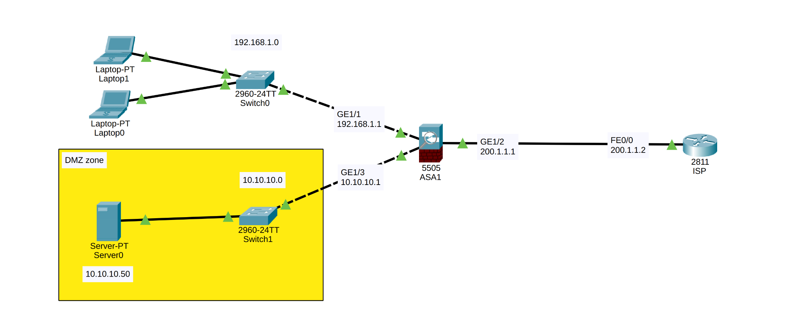

# Cisco ASA Firewall: Inside, DMZ, and Outside Zone Implementation

## 📌 Project Overview
This project focuses on enterprise perimeter security using a **Cisco ASA (Adaptive Security Appliance)** in Cisco Packet Tracer. The objective is to design and configure a secure network architecture segmented into three distinct security zones: **Inside (Trusted)**, **DMZ (Semi-Trusted)**, and **Outside (Untrusted/ISP)**. The firewall enforces strict access control, performs Network Address Translation (NAT), and utilizes stateful traffic inspection.

## 🏗️ Network Topology & Security Zones
The network topology is centralized around the Cisco ASA firewall, effectively separating the internal network from the public-facing DMZ and the Internet.

> **Topology Reference:**
> 

### Zone & Interface Assignments
The firewall utilizes VLANs to logically separate the physical interfaces into distinct security domains based on Cisco's Security Level architecture (0-100).

| Zone | VLAN | Security Level | IP Subnet | Interface | Purpose |
| :--- | :--- | :--- | :--- | :--- | :--- |
| **Inside** | `VLAN 1` | `100` (Highest) | `192.168.1.0/24` | Eth0/1 | Private corporate network (Highly trusted). |
| **DMZ** | `VLAN 2` | `50` (Medium) | `10.10.10.0/24` | Eth0/3 | Hosts public-facing servers (Isolated from Inside). |
| **Outside** | `VLAN 3` | `0` (Lowest) | `200.1.1.0/24` | Eth0/2 | Untrusted ISP/Internet connection. |

## ⚙️ Core Firewall Configurations

### 1. Zone Isolation & Security Levels
By default, traffic is permitted from higher security levels to lower ones, but denied from lower to higher. An additional command (`no forward interface Vlan 1`) was explicitly applied to the DMZ to prevent any compromised DMZ servers from initiating connections into the secure Inside network.

### 2. NAT (Network Address Translation)
Dynamic PAT (Port Address Translation) was configured for the **Inside Network**. 
* **Object Network:** `INSIDE_NETWORK` (`192.168.1.0/24`)
* **Rule:** `nat (inside,outside) dynamic interface` translates all internal outbound traffic to the ASA's Outside interface IP (`200.1.1.1`), hiding the private topology from the internet.

### 3. Default Routing
A default static route was configured to direct all unknown external traffic out to the ISP's gateway:
* `route outside 0.0.0.0 0.0.0.0 200.1.1.2`

### 4. Stateful Traffic Inspection (Modular Policy Framework)
To allow return traffic for connections initiated from the Inside network (like pinging the ISP or browsing), the ASA's global policy was updated to inspect ICMP and HTTP traffic statefully.
* **Policy-map:** `global_policy`
* **Inspections:** `inspect icmp`, `inspect http`

## 💻 CLI Configuration Script
Below is the complete configuration script applied to the Cisco ASA Firewall to achieve the intended security posture:

```text
enable
configure terminal

! --- Interface to VLAN mapping ---
interface Ethernet0/1
 switchport access vlan 1
 no shutdown
 exit
interface Ethernet0/2
 switchport access vlan 3
 no shutdown
 exit
interface Ethernet0/3
 switchport access vlan 2
 no shutdown
 exit

! --- VLAN & Security Level Configuration ---
interface Vlan 1
 nameif inside
 security-level 100
 ip address 192.168.1.1 255.255.255.0
 no shutdown
 exit
interface Vlan 2
 no forward interface Vlan 1
 nameif dmz
 security-level 50
 ip address 10.10.10.1 255.255.255.0
 no shutdown
 exit
interface Vlan 3
 nameif outside
 security-level 0
 ip address 200.1.1.1 255.255.255.0
 no shutdown
 exit

! --- Dynamic NAT Configuration ---
object network INSIDE_NETWORK
 subnet 192.168.1.0 255.255.255.0
 nat (inside,outside) dynamic interface
 exit

! --- Default Route to ISP ---
route outside 0.0.0.0 0.0.0.0 200.1.1.2

! --- Stateful Traffic Inspection (ICMP & HTTP) ---
class-map inspection_default
 match default-inspection-traffic
 exit
policy-map global_policy
 class inspection_default
  inspect icmp
  inspect http
 exit
exit
service-policy global_policy global
exit
write memory
