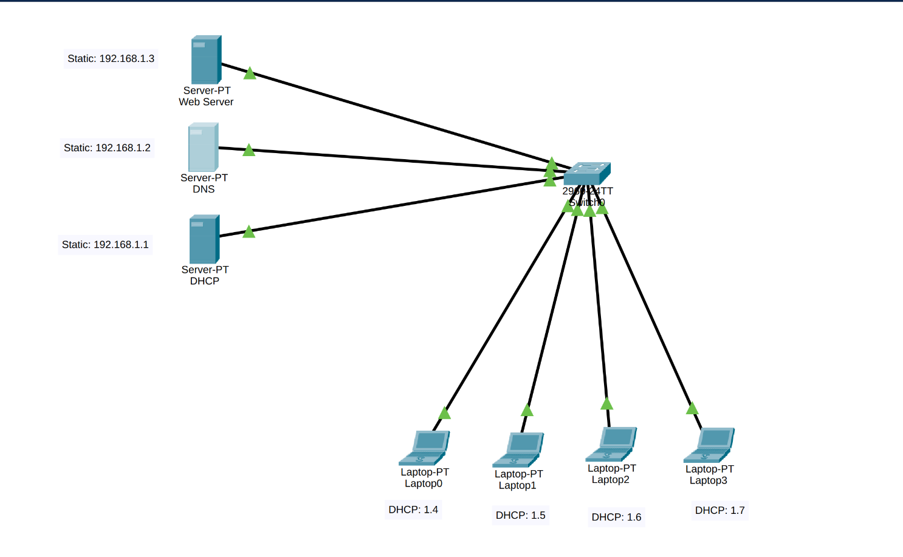
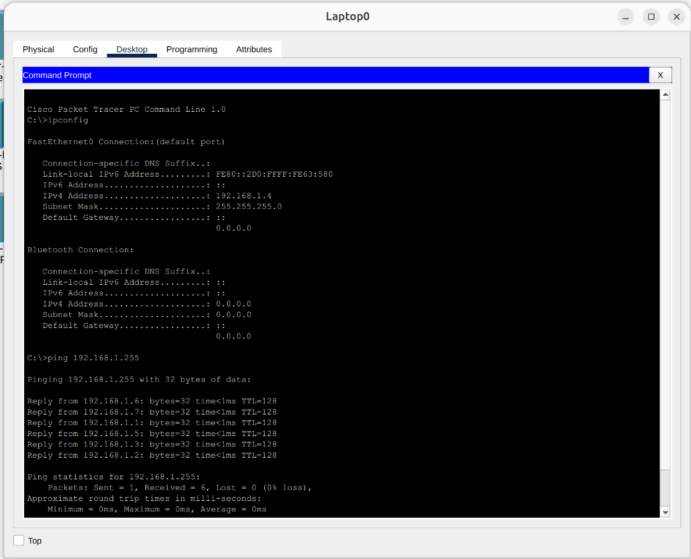
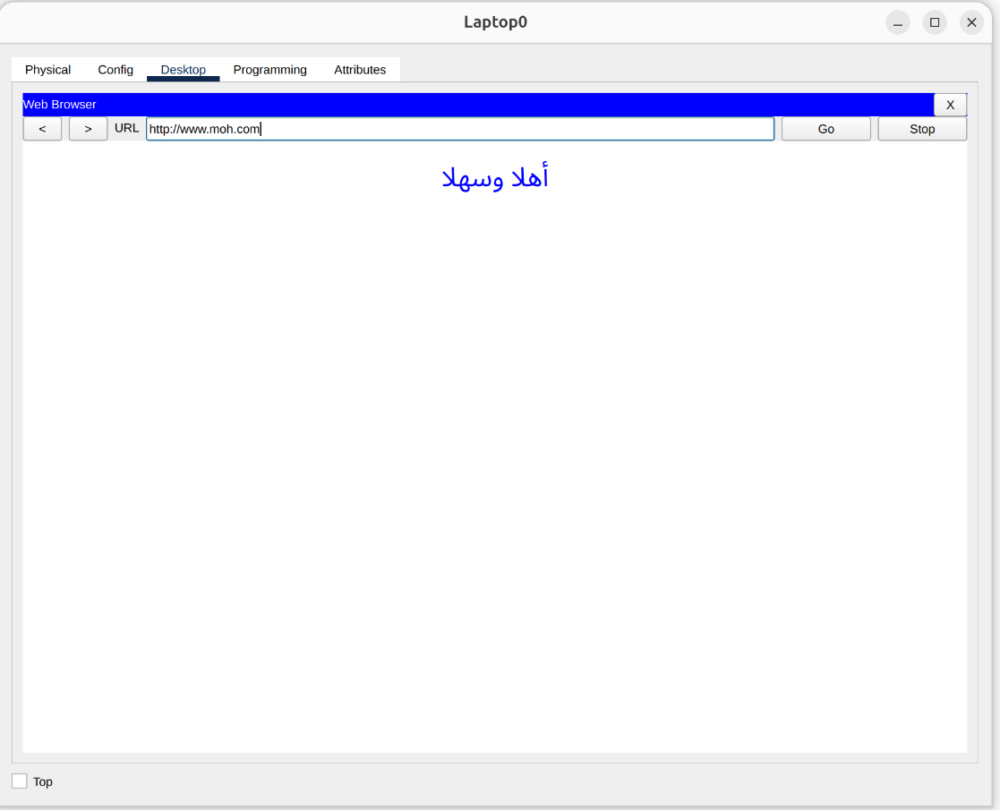

# Basic Local Area Network with Core Services (DHCP, DNS, Web Server)

## 📌 Project Overview
This project is a network simulation built using **Cisco Packet Tracer**. It demonstrates the implementation of a basic Local Area Network (LAN) that utilizes core network services. The network consists of three dedicated servers providing dynamic IP addressing (DHCP), domain name resolution (DNS), and web hosting (HTTP) for multiple end devices connected via a central switch.

## 🏗️ Network Topology
The network topology includes the following components:
* **Network Devices:** 1x Cisco Switch.
* **Servers:** 3x Servers (DHCP, DNS, Web Server).
* **End Devices:** 4x PCs.
   > 

## ⚙️ Configuration Details
All devices are connected to the same local network. The servers are configured with static IP addresses, while the PCs receive their network configuration dynamically.

* **DHCP Server (IP: `192.168.1.1`)** 
  * Configured to automatically assign IP addresses to the 4 end devices from the `192.168.1.x` pool.
* **DNS Server (IP: `192.168.1.2`)** 
  * Configured to resolve the domain name `www.moh.com` to the IP address of the Web Server.
* **Web Server (IP: `192.168.1.3`)** 
  * Hosts a simple website accessible via HTTP.

## 🧪 Testing & Verification
The network's functionality was fully tested to ensure proper communication and service delivery. 

### 1. Connectivity & DHCP Verification (`test 1`)
* Used the `ipconfig` command on the end devices to verify that they successfully received IP configurations from the DHCP server.
* Executed the `ping` command to test end-to-end connectivity between the PCs and the servers. All pings were successful with 0% packet loss.
  > 

### 2. DNS & Web Server Verification (`test 2`)
* Opened the web browser on an end device and navigated to `www.moh.com`.
* The DNS server successfully resolved the domain, and the Web Server correctly displayed the hosted webpage.
  > 

## 🛠️ Technologies Used
* Cisco Packet Tracer
* IPv4 Addressing
* DHCP (Dynamic Host Configuration Protocol)
* DNS (Domain Name System)
* HTTP (Hypertext Transfer Protocol)
* ICMP (Ping)
