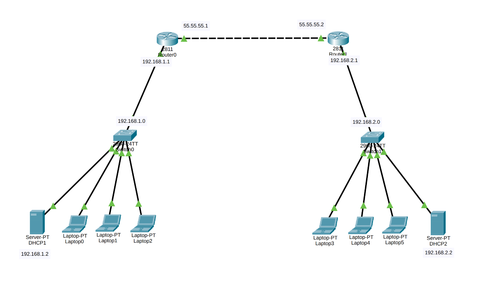
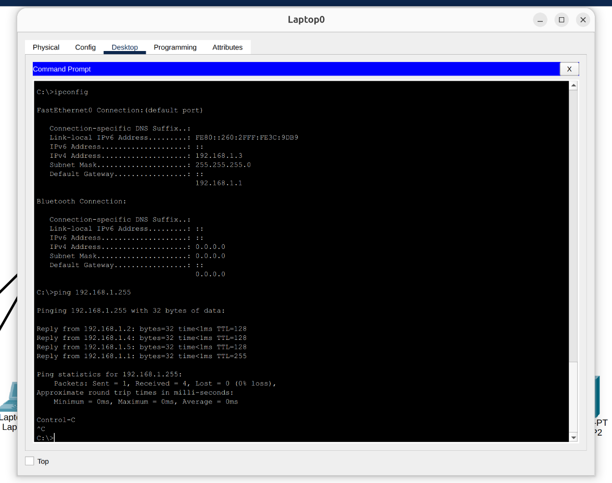
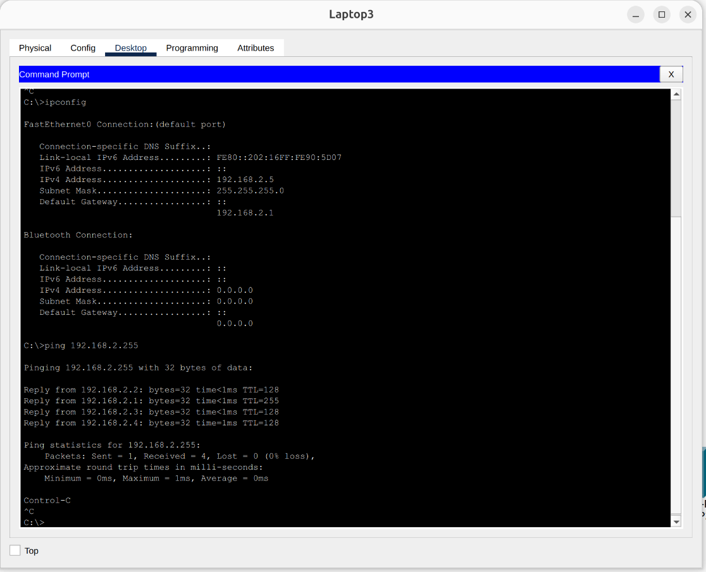
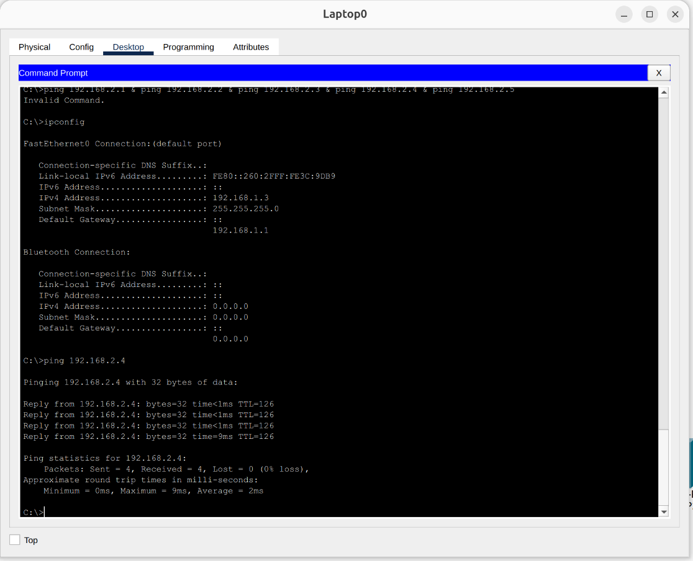
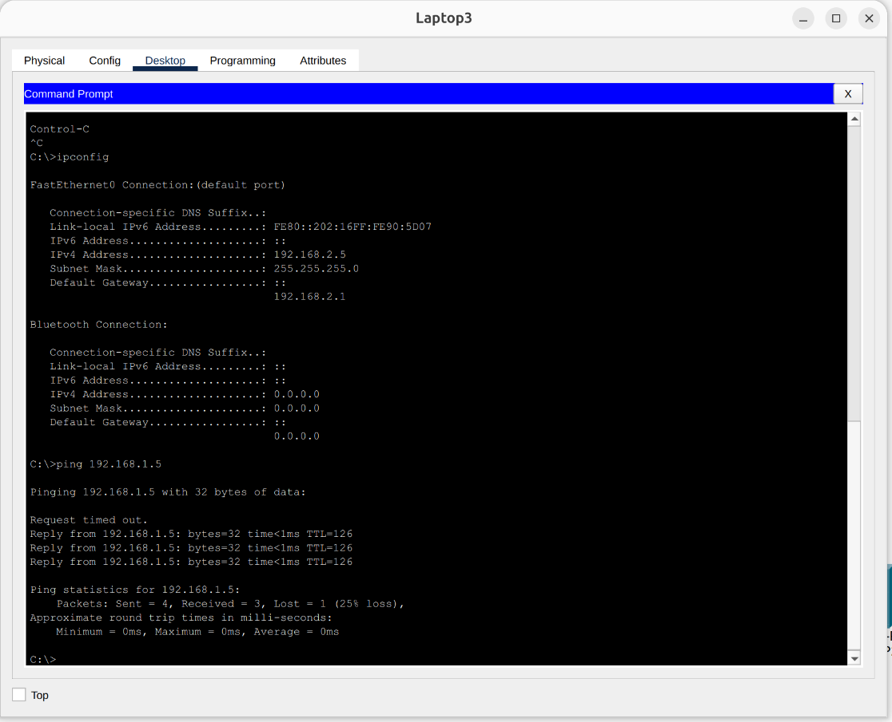
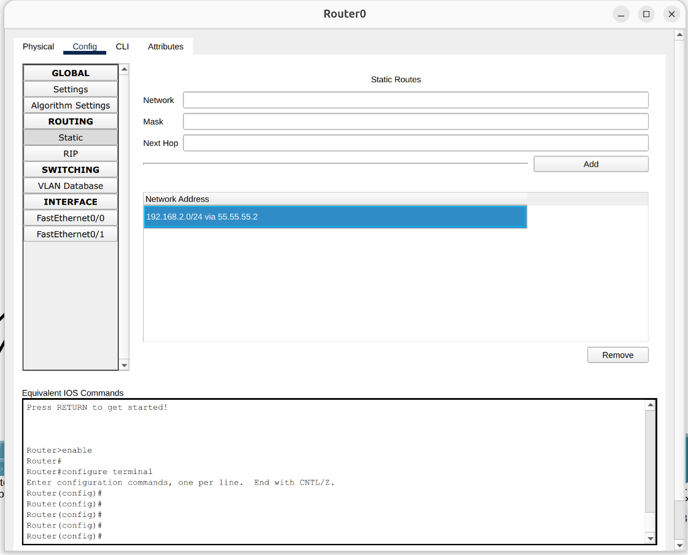

# Static Routing Between Two Distinct Networks

## 📌 Project Overview
This project simulates the connection of two separate Local Area Networks (LANs) using Cisco Packet Tracer. It demonstrates the implementation of **Static Routing** to enable end-to-end communication between different subnets across two routers. Additionally, it features independent DHCP services for each network to automate IP address assignment.

## 🏗️ Network Topology
The network is divided into two distinct sites, connected via point-to-point router links:
* **Routers:** 2x Cisco Routers connecting the two networks.
* **Switches:** 2x Cisco Switches (one for each LAN).
* **Servers:** 2x DHCP Servers (one dedicated to each network).
* **End Devices:** Multiple PCs in both networks.
  > 

## ⚙️ Configuration Details
The project is structured into two main subnets with static routes pointing to each other:

### Network 1 (LAN A)
* **Network Address:** `192.168.1.0/24`
* **DHCP Server:** Configured to automatically assign IP addresses to end devices within the `192.168.1.x` range.

### Network 2 (LAN B)
* **Network Address:** `192.168.2.0/24`
* **DHCP Server:** Configured to automatically assign IP addresses to end devices within the `192.168.2.x` range.

### Routing Configuration
* **Static Routing:** Configured manually on both routers to define the paths to the remote networks. 
  * Router 1 is configured with a static route to reach the `192.168.2.0` network.
  * Router 2 is configured with a static route to reach the `192.168.1.0` network.

## 🧪 Testing & Verification
Comprehensive testing was conducted to ensure full connectivity both within each local network and across the routed networks.

### 1. Local Network Connectivity (Intra-Network)
* Successfully pinged all devices within **Network 1** to ensure local switching and DHCP IP assignment are working correctly.
  > 
* Successfully pinged all devices within **Network 2**.
  > 

### 2. End-to-End Connectivity (Inter-Network)
* Initiated a ping test from a PC in **Network 1** to a PC in **Network 2** to verify that packets successfully traverse the routers.
  > 
* Initiated a reverse ping test from a PC in **Network 2** back to **Network 1** to confirm two-way communication.
  > 

### 3. Routing Table Verification
* Verified the static routing configuration on **Router 1**, ensuring the route to `192.168.2.0` is active.
  > 
* Verified the static routing configuration on **Router 2**, ensuring the route to `192.168.1.0` is active.
  > 

## 🛠️ Technologies & Protocols Used
* Cisco Packet Tracer
* IPv4 Addressing & Subnetting
* Static Routing
* DHCP (Dynamic Host Configuration Protocol)
* ICMP (Ping / Echo Requests)
