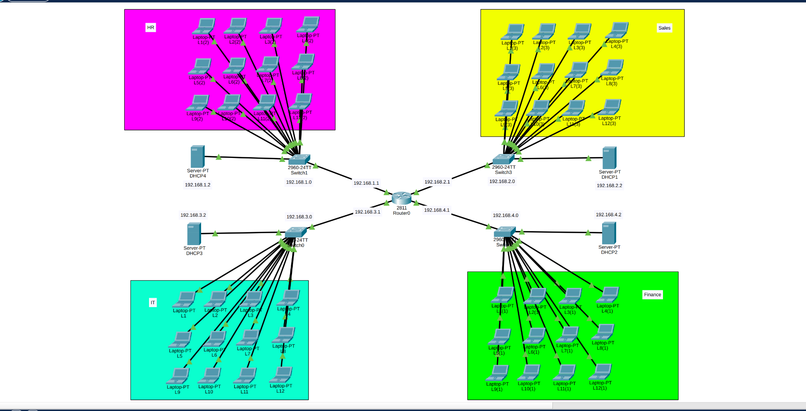
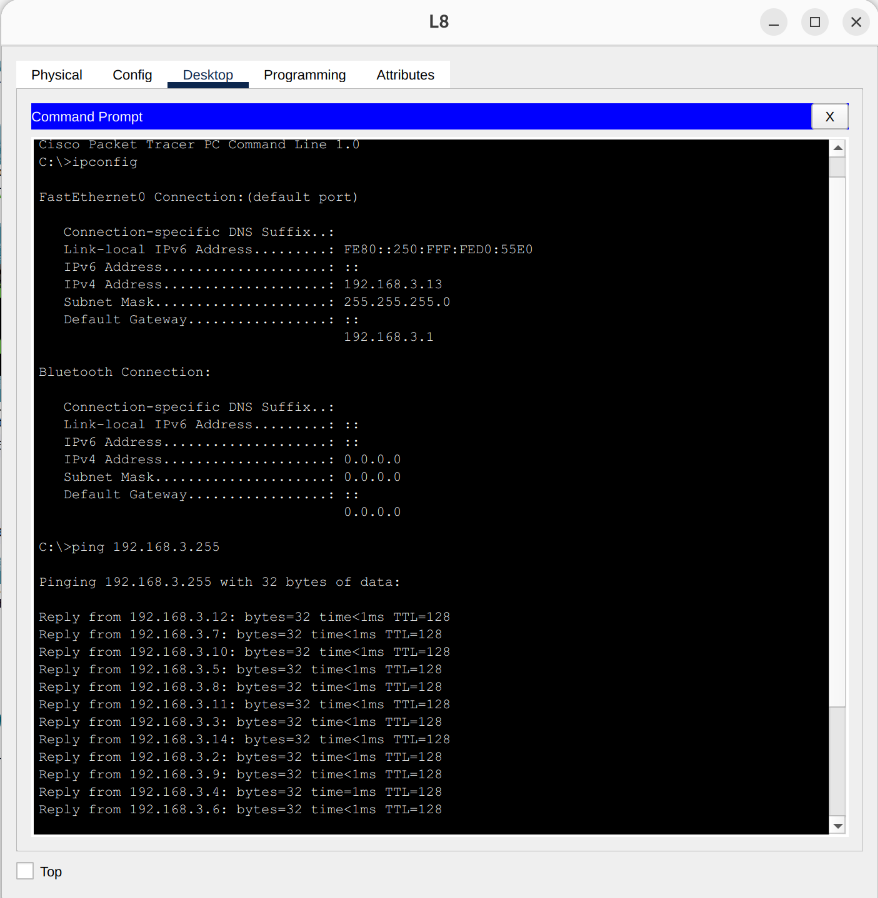
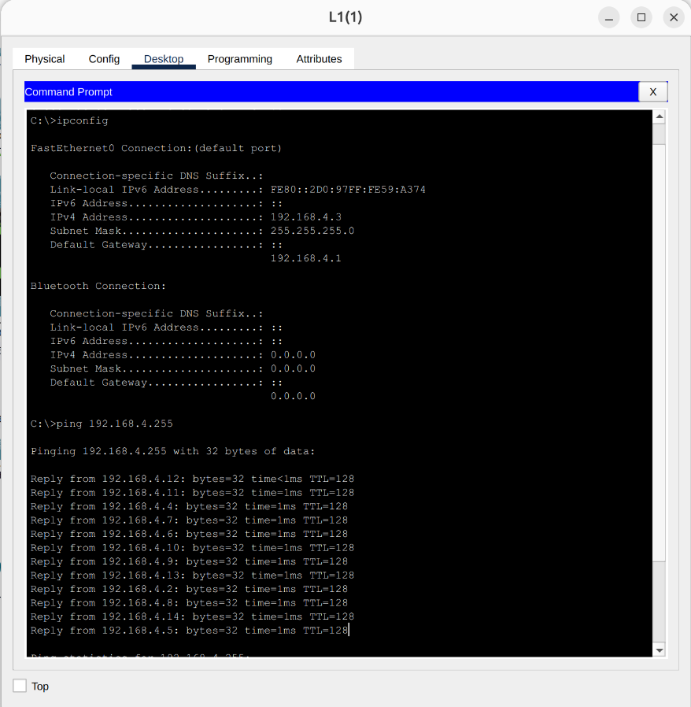
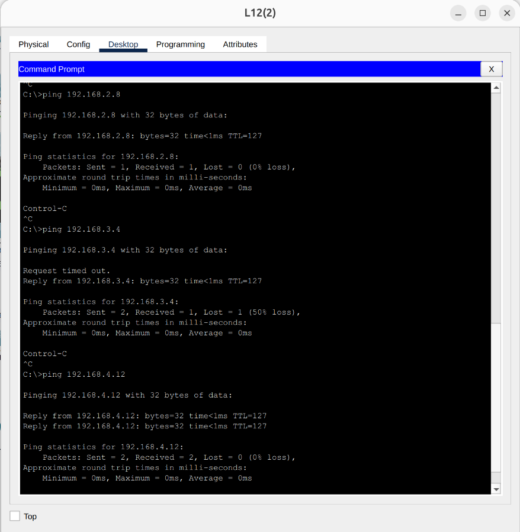

# Enterprise Corporate Network Topology (Multi-Department)

## 📌 Project Overview
This project simulates a fully functional corporate network environment designed for a company with four distinct departments: **HR, Sales, IT, and Finance**. To ensure network organization and broadcast domain isolation, each department is assigned its own dedicated subnet, switch, and DHCP server. A central router connects all departments, enabling secure inter-departmental communication.

## 🏗️ Network Topology
The corporate network is built with the following hardware distribution:
* **Central Routing:** 1x Cisco Router connecting all department networks.
* **Switches:** 4x Cisco Switches (One dedicated to each department).
* **DHCP Servers:** 4x Servers (One per department to automate IP assignment).
* **End Devices:** 48x PCs in total (12 PCs per department).
  > 

## 🖧 IP Addressing & Subnet Architecture
The network uses IPv4 addressing, logically divided into four subnets. Each department relies on its local DHCP server for dynamic IP allocation.

| Department | Network Address | Subnet Mask | Devices per Dept. | DHCP Server |
| :--- | :--- | :--- | :--- | :--- |
| **HR** | `192.168.1.0` | `255.255.255.0` (/24) | 12 PCs | ✅ Yes |
| **Sales** | `192.168.2.0` | `255.255.255.0` (/24) | 12 PCs | ✅ Yes |
| **IT** | `192.168.3.0` | `255.255.255.0` (/24) | 12 PCs | ✅ Yes |
| **Finance** | `192.168.4.0` | `255.255.255.0` (/24) | 12 PCs | ✅ Yes |

## 🧪 Testing & Verification
Extensive testing was performed to validate local connectivity within each department, as well as global connectivity across the entire corporate network.

### 1. Local Department Connectivity (Intra-Network)
Verified that all PCs successfully obtained IP addresses from their respective DHCP servers and can communicate with other devices within the same department.
* **HR Department Test:** Pinged all local devices.
  > 
* **Sales Department Test:** Pinged all local devices.
  > 
* **IT Department Test:** Pinged all local devices.
  > 
* **Finance Department Test:** Pinged all local devices.
  > 

### 2. Corporate-Wide Connectivity (Inter-Departmental)
Verified that the central router successfully routes traffic between different subnets. 
* Initiated a ping test from a PC in the **HR Department (`192.168.1.3`)** to random PCs in the **Sales, IT, and Finance** departments. All replies were successful, confirming full network convergence.
  > 

## 🛠️ Technologies & Protocols Used
* Cisco Packet Tracer Simulation
* Enterprise Network Design
* IPv4 Addressing & Subnetting
* Inter-Network Routing
* DHCP (Dynamic Host Configuration Protocol)
* ICMP (Connectivity Testing)
