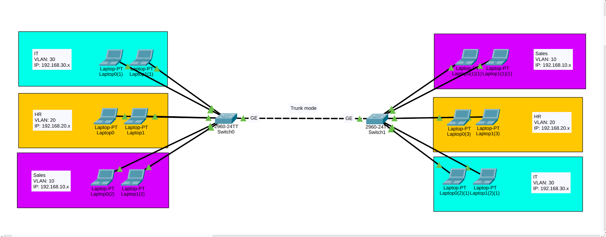
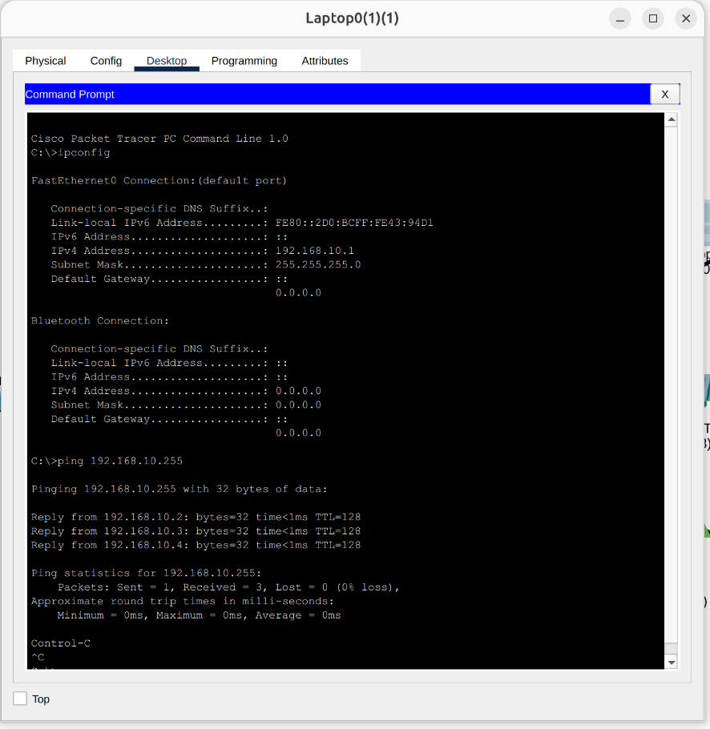
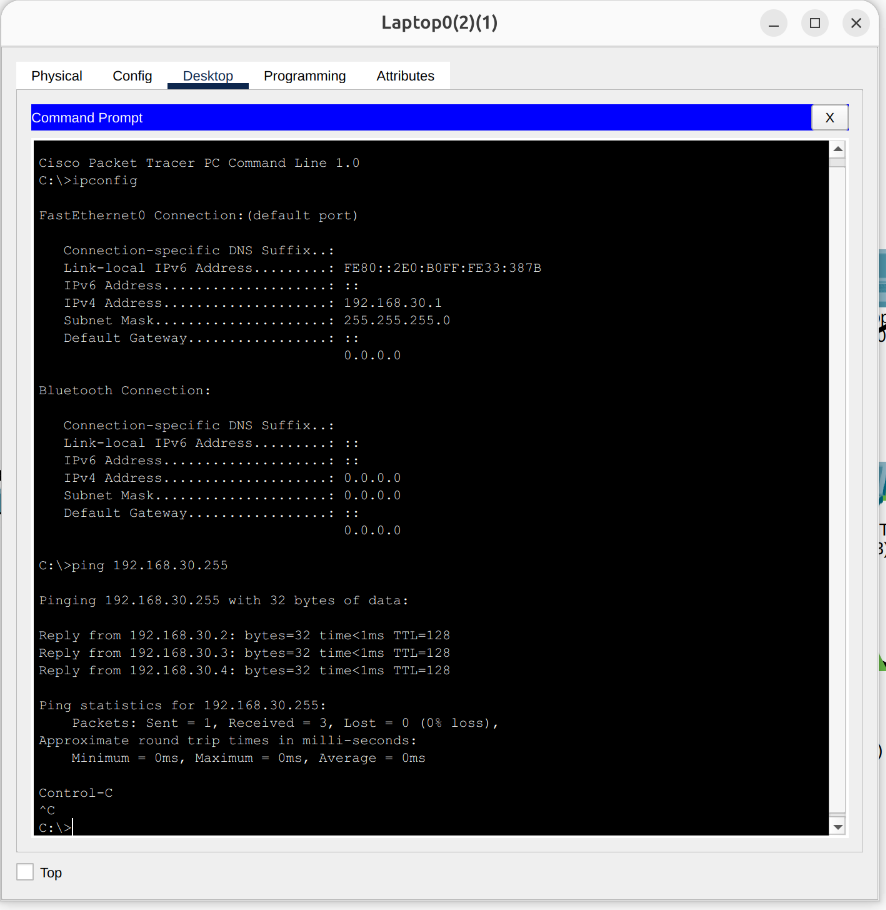
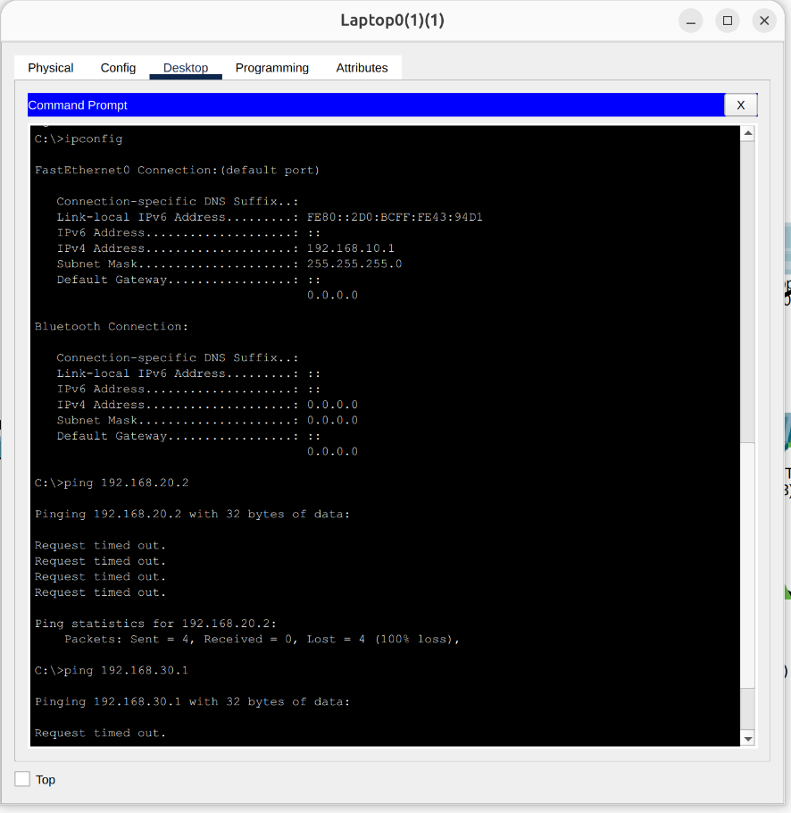

# VLAN Implementation & Trunking in a Multi-Floor Corporate Network

## 📌 Project Overview
This project demonstrates the design and implementation of **Virtual Local Area Networks (VLANs)** in a multi-floor corporate environment using Cisco Packet Tracer. The scenario involves a company with three departments (IT, HR, and Sales) whose employees are randomly distributed across two floors. 

Instead of physical separation, the network uses VLANs to logically group devices by department regardless of their physical location. An IEEE 802.1Q **Trunk link** connects the switches on both floors, allowing traffic for all VLANs to pass seamlessly between them.

## 🏗️ Network Topology
* **Switches:** 2x Cisco Switches (One per floor).
* **Interconnect:** A GigabitEthernet (GE) link connecting the two switches, configured in **Trunk Mode**.
* **End Devices:** Multiple PCs distributed randomly across the 1st and 2nd floors.
  > 

## 🖧 VLAN & IP Addressing Schema
To isolate broadcast domains and secure department traffic, end devices are assigned to specific VLANs and subnets based on their department:

| Department | VLAN ID | IP Subnet | Access Ports |
| :--- | :--- | :--- | :--- |
| **IT** | `VLAN 10` | `192.168.10.0/24` | Configured as Access |
| **HR** | `VLAN 20` | `192.168.20.0/24` | Configured as Access |
| **Sales** | `VLAN 30` | `192.168.30.0/24` | Configured as Access |

## ⚙️ Key Configurations
* **Access Ports:** Switch ports connected to PCs are configured in Access mode and assigned to their respective VLANs.
* **Trunk Port:** The GigabitEthernet ports connecting the two switches are configured in Trunk mode to carry traffic for VLANs 10, 20, and 30 across both floors.

## 🧪 Testing & Verification
Testing was conducted to verify both connectivity within the same department (across floors) and the successful isolation between different departments.

### 1. Intra-VLAN Connectivity (Cross-Floor Success)
Verified that devices in the same VLAN can ping each other, even if they are connected to different switches on different floors.
* **VLAN 10 (IT) Test:** Successful ping between IT devices.
  > 
* **VLAN 20 (HR) Test:** Successful ping between HR devices.
  > 
* **VLAN 30 (Sales) Test:** Successful ping between Sales devices.
  > 

### 2. VLAN Isolation Test (Security Verification)
* Attempted a ping from a random device in **VLAN 10 (IT)** to devices in **VLAN 20 (HR)** and **VLAN 30 (Sales)**.
* **Result:** The ping dropped/failed (Request Timed Out). This successfully proves that the VLANs are properly isolating traffic and isolating broadcast domains, as intended (since no Inter-VLAN routing is configured).
  > 
  
## 🛠️ Technologies & Protocols Used
* Cisco Packet Tracer
* IEEE 802.1Q VLAN Trunking
* VLAN Assignment & Broadcast Domain Isolation
* Switch Port Security (Access & Trunk Modes)
* IPv4 Addressing
