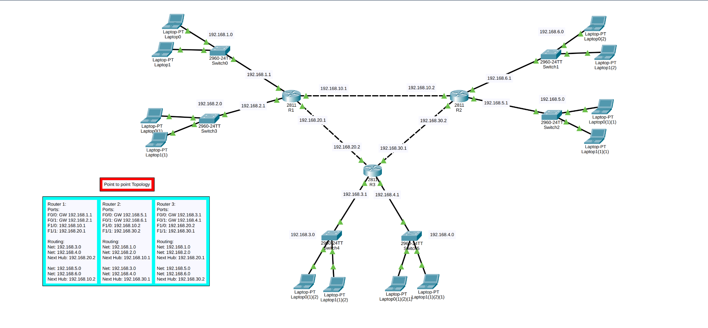
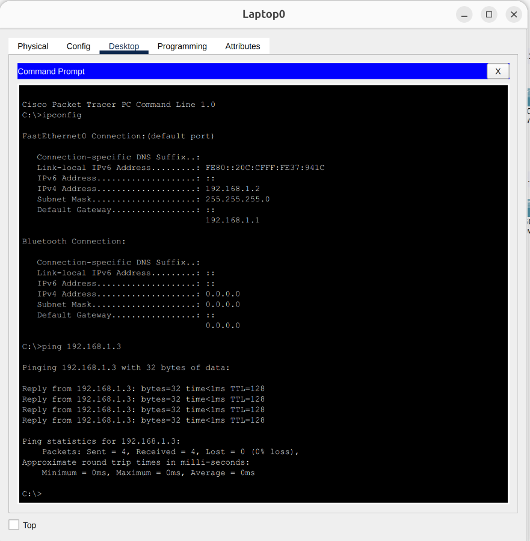
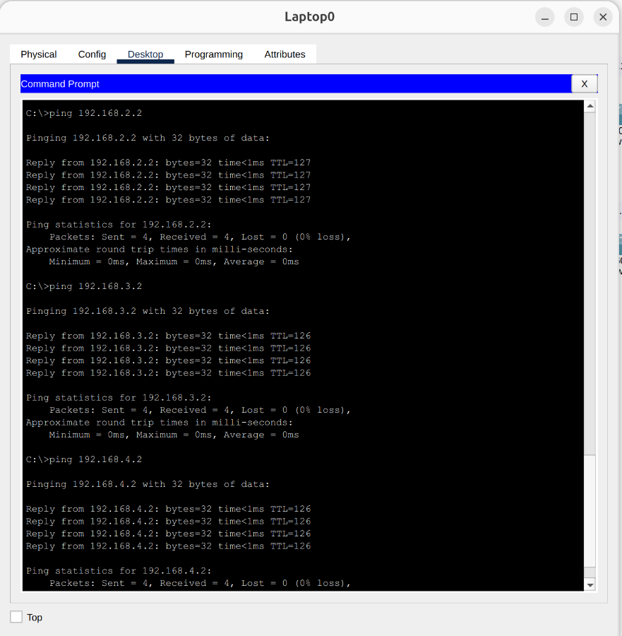
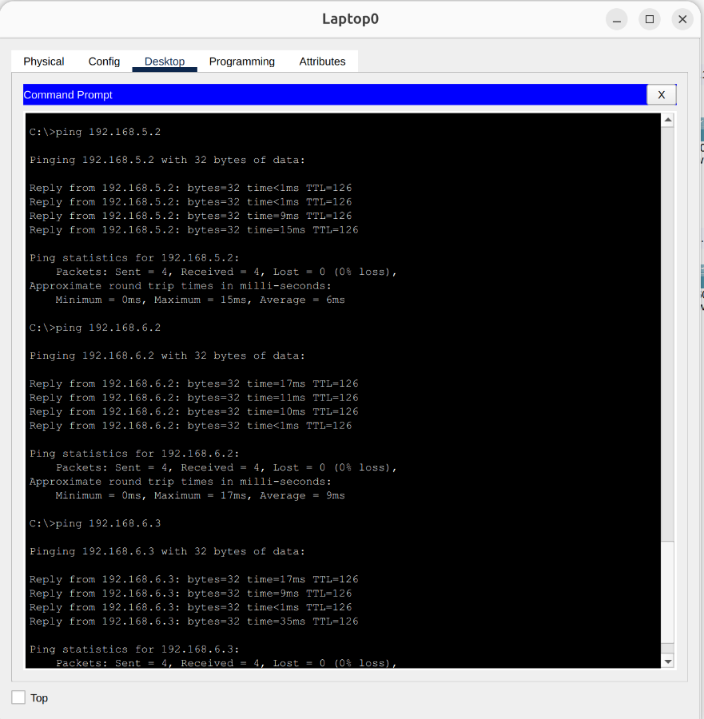

# Point-to-Point Network Topology with Static Routing

## 📌 Project Overview
This project simulates a Wide Area Network (WAN) topology using **Cisco Packet Tracer**. It consists of three routers connected via Point-to-Point links. Each router acts as a default gateway for two distinct Local Area Networks (LANs), resulting in six separate local networks in total. Full network communication is achieved through the manual implementation of **Static Routing**.

## 🏗️ Network Topology & IP Schema
The network architecture is based on the configurations detailed in the project reference diagram
  > 

### Router Interfaces & Local Networks
| Router | Interface | IP Address (Gateway) | Connected Network |
| :--- | :--- | :--- | :--- |
| **Router 1** | F0/0 | 192.168.1.1 | LAN 1 |
| **Router 1** | F0/1 | 192.168.2.1 | LAN 2 |
| **Router 2** | F0/0 | 192.168.5.1 | LAN 5 |
| **Router 2** | F0/1 | 192.168.6.1 | LAN 6 |
| **Router 3** | F0/0 | 192.168.3.1 | LAN 3 |
| **Router 3** | F0/1 | 192.168.4.1 | LAN 4 |

### Point-to-Point Links (Router Interconnects)
* **Router 1 to Router 2:** `192.168.10.1` (R1 F1/0) <--> `192.168.10.2` (R2 F1/0)
* **Router 1 to Router 3:** `192.168.20.1` (R1 F1/1) <--> `192.168.20.2` (R3 F1/0)
* **Router 2 to Router 3:** `192.168.30.2` (R2 F1/1) <--> `192.168.30.1` (R3 F1/1)

## ⚙️ Static Routing Configuration
To enable end-to-end communication, static routes were manually configured on each router pointing to the remote networks via the correct **Next Hop** IP addresses.

| Router | Target Networks | Next Hop IP |
| :--- | :--- | :--- |
| **Router 1** | 192.168.3.0, 192.168.4.0 | 192.168.20.2 |
| **Router 1** | 192.168.5.0, 192.168.6.0 | 192.168.10.2 |
| **Router 2** | 192.168.1.0, 192.168.2.0 | 192.168.10.1 |
| **Router 2** | 192.168.3.0, 192.168.4.0 | 192.168.30.1 |
| **Router 3** | 192.168.1.0, 192.168.2.0 | 192.168.20.1 |
| **Router 3** | 192.168.5.0, 192.168.6.0 | 192.168.30.2 |

## 🧪 Testing & Verification
Comprehensive ping tests were conducted from a single source machine (`192.168.1.2`) in LAN 1 to verify internal switching and complete routing across the topology.

### 1. Internal Network Testing (Intra-LAN)
* Successfully pinged `192.168.1.3` from `192.168.1.2` to confirm local switching and connectivity within the same local subnet.
  > 

### 2. External Network Testing (Adjacent Networks)
* Successfully pinged devices in neighboring networks (`192.168.2.2`, `192.168.3.2`, `192.168.4.2`) to verify the first set of static routes traversing Router 1 and Router 3.
  > 

### 3. External Network Testing (Remote Networks)
* Successfully pinged devices in the remaining remote networks (`192.168.5.2`, `192.168.6.2`, `192.168.6.3`) to ensure full network convergence and valid routing rules across Router 2.
  > 

## 🛠️ Technologies & Protocols Used
* Cisco Packet Tracer
* Static IP Routing
* Point-to-Point WAN Links
* IPv4 Subnetting & Gateway Configuration
* ICMP (Connectivity Verification)
