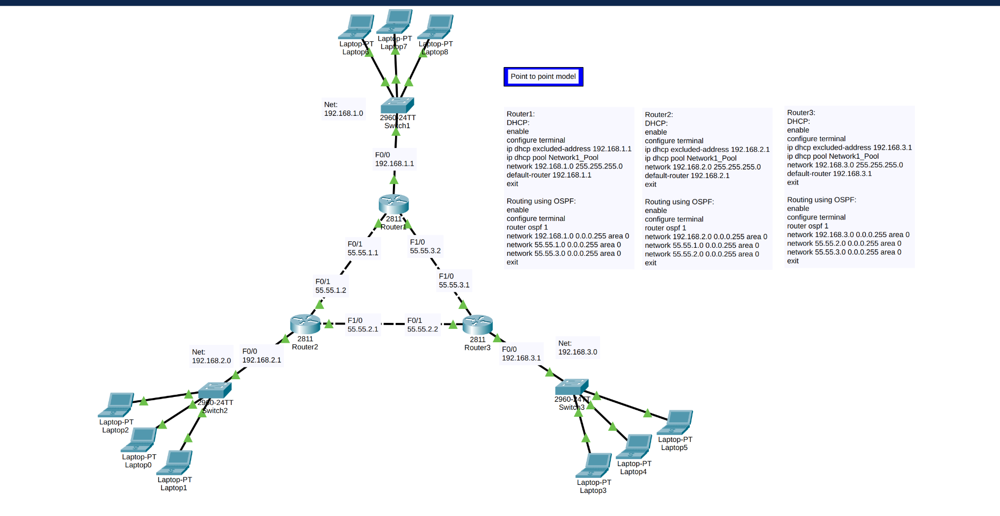
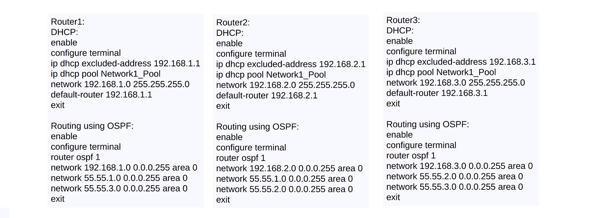
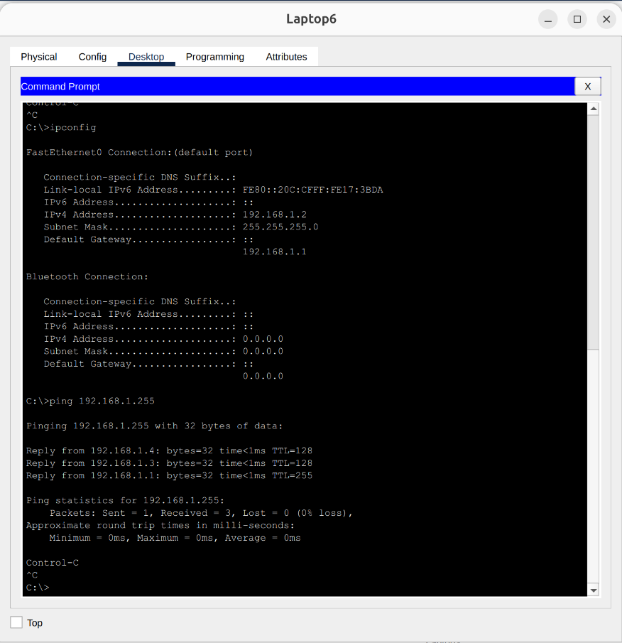
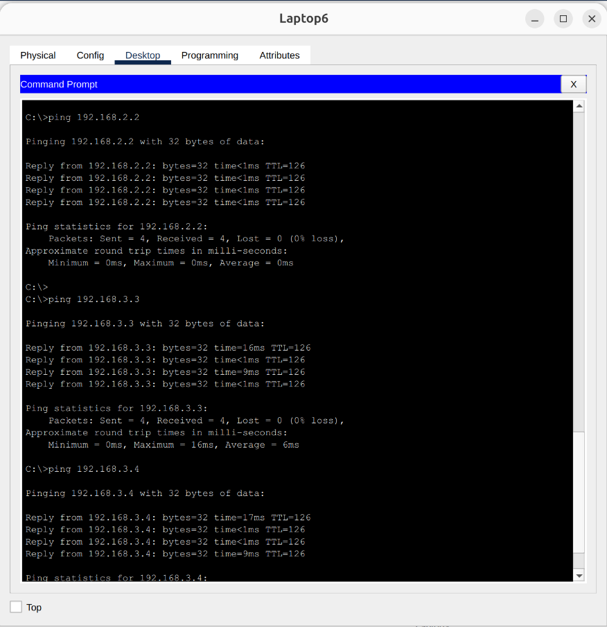

# Dynamic Routing (OSPF) and Router-Based DHCP in a WAN Topology

## 📌 Project Overview
This project simulates a Wide Area Network (WAN) connecting three remote sites using **Cisco Packet Tracer**. It highlights the transition from static routing to dynamic routing by implementing the **OSPF (Open Shortest Path First)** protocol. Additionally, it demonstrates how to configure Cisco routers to act as **DHCP servers**, automatically provisioning IP addresses to their directly connected Local Area Networks (LANs).

## 🏗️ Network Topology
The network is structured in a triangular point-to-point topology:
* **Routers:** 3x Cisco Routers connected via Point-to-Point WAN links.
* **Switches:** 3x Cisco Switches (One per site).
* **End Devices:** Multiple laptops/PCs per site relying on dynamic IP allocation.
> 

### 🖧 IP Addressing Schema
The topology consists of three LAN subnets and three point-to-point WAN subnets:

| Location | Network / Subnet | Default Gateway | Interface |
| :--- | :--- | :--- | :--- |
| **LAN 1 (Router 1)** | `192.168.1.0/24` | `192.168.1.1` | F0/0 |
| **LAN 2 (Router 2)** | `192.168.2.0/24` | `192.168.2.1` | F0/0 |
| **LAN 3 (Router 3)** | `192.168.3.0/24` | `192.168.3.1` | F0/0 |
| **WAN (R1 <-> R2)** | `55.55.1.0/24` | N/A | R1(F0/1) - R2(F0/1) |
| **WAN (R2 <-> R3)** | `55.55.2.0/24` | N/A | R2(F1/0) - R3(F0/1) |
| **WAN (R1 <-> R3)** | `55.55.3.0/24` | N/A | R1(F1/0) - R3(F1/0) |

## ⚙️ Core Configurations

### 1. Router-Based DHCP Services
Instead of using dedicated servers, each router is configured via the CLI to act as a DHCP server for its respective local network. The router's own IP is excluded from the pool and set as the default gateway.

### 2. Single-Area OSPF Dynamic Routing
OSPF Process ID `1` is configured on all routers in **Area 0**. The networks advertised by each router include their directly connected LANs and their point-to-point WAN links. This allows the routers to dynamically build their routing tables and adapt to topology changes without manual static route entries.

*(View the CLI configuration scripts used for this project here:)*
> 

## 🧪 Testing & Verification
To ensure proper DHCP functionality and complete network convergence via OSPF, the following connectivity tests were performed:

### 1. Local Network & DHCP Verification (Broadcast Ping)
* Executed a ping to the broadcast address `192.168.1.255` from a device in LAN 1. 
* All active devices within the `192.168.1.0/24` network replied, confirming that the router successfully assigned IP addresses via DHCP and internal switching is operational.
  > 

### 2. OSPF Dynamic Routing Verification (Inter-Network Ping)
* Initiated a ping test from a specific device in LAN 1 (`192.168.1.2`) to three random end devices located in the remote networks (LAN 2 and LAN 3).
* All replies were successful, proving that the OSPF protocol correctly populated the routing tables and enabled end-to-end communication across the WAN links.
  > 

## 🛠️ Technologies & Protocols Used
* Cisco Packet Tracer
* Dynamic Routing: OSPF (Single-Area 0)
* Router as a DHCP Server (CLI Configuration)
* Point-to-Point WAN Links
* Wildcard Masks (for OSPF network statements)
* IPv4 Addressing & Subnetting
