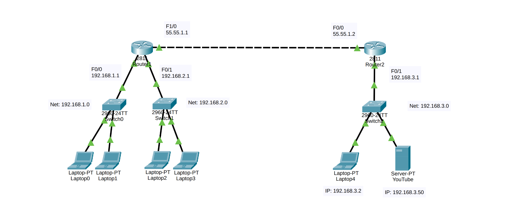
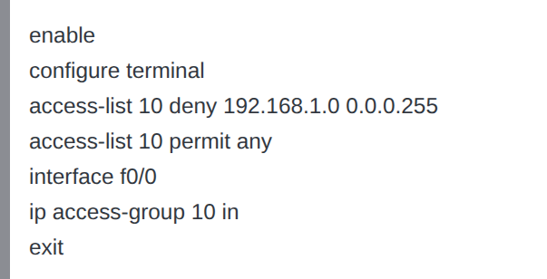
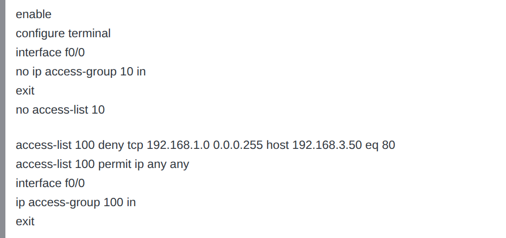
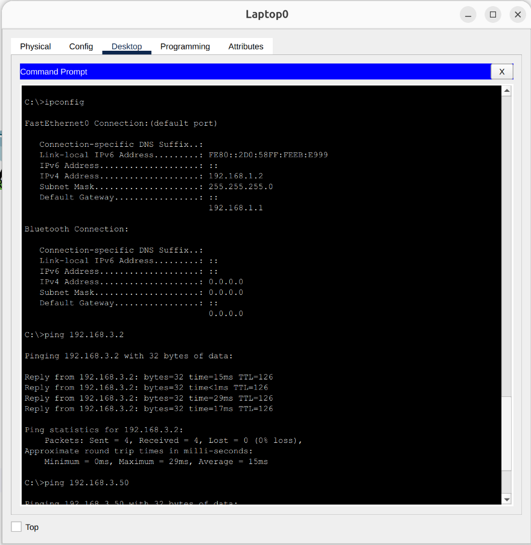
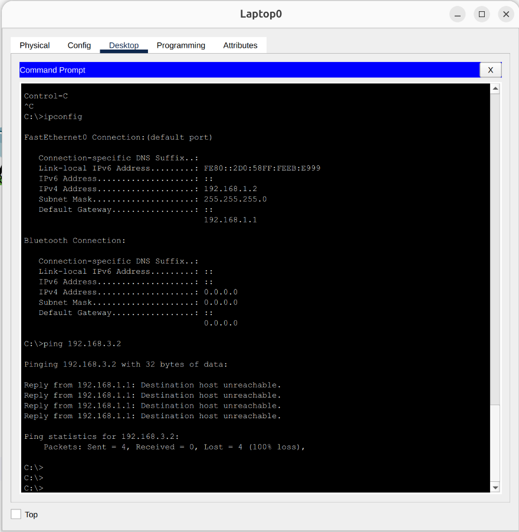
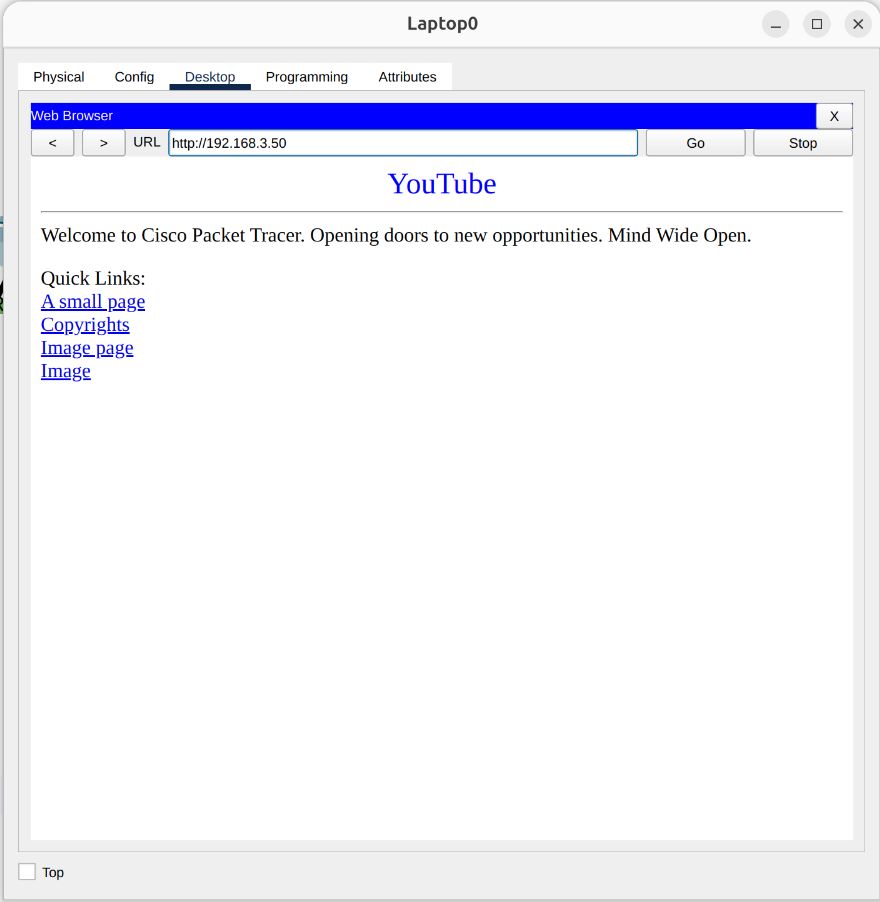
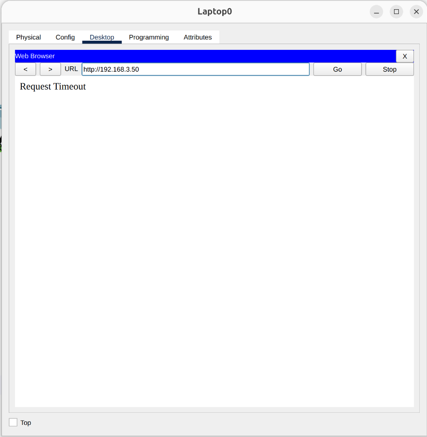
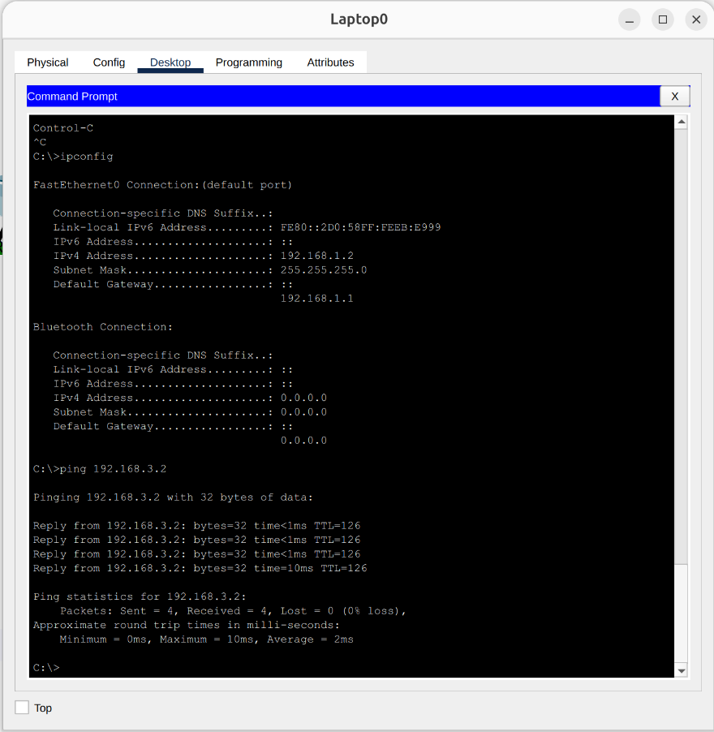

# Network Security & Traffic Filtering using Standard and Extended ACLs

## 📌 Project Overview
This project focuses on implementing **Access Control Lists (ACLs)** to enforce network security and manage traffic flow using Cisco Packet Tracer. The lab demonstrates the application of both **Standard ACLs** (filtering based on source IP) and **Extended ACLs** (filtering based on specific protocols, source, and destination IPs) to control access between different subnets and a dedicated web server.

## 🏗️ Network Topology
The network consists of two routers connected via a point-to-point link:
* **Router 1:** Connects two local networks (`192.168.1.0/24` and `192.168.2.0/24`).
* **Router 2:** Connects a single local network (`192.168.3.0/24`), which hosts end user devices and a dedicated **YouTube Web Server** (`192.168.3.50`).

> **Topology Reference:**
> 

## ⚙️ Security Implementations (ACLs)
The project was executed in two distinct phases to demonstrate different levels of traffic filtering.

### Phase 1: Standard ACL (Network-Wide Block)
* **Objective:** Completely deny the `192.168.1.0` network from reaching the `192.168.3.0` network.
* **Configuration:** A Standard ACL (List 10) was created to drop all packets originating from `192.168.1.0/24` and applied inbound on Router 1's FastEthernet 0/0 interface.
* **Code Reference:**
  > 

### Phase 2: Extended ACL (Targeted Service Block)
* **Objective:** Remove the previous restriction and apply a more granular rule. Deny the `192.168.1.0` network from accessing *only* the YouTube Web Server (`192.168.3.50`) via HTTP (Port 80), while allowing all other traffic to pass.
* **Configuration:** The Standard ACL was removed. An Extended ACL (List 100) was configured to deny TCP traffic targeting port 80 on the server's specific host IP, permitting all other IP traffic.
* **Code Reference:**
  > 

## 🧪 Testing & Verification
Comprehensive testing was conducted before and after applying the ACLs to verify their operational accuracy.

### Standard ACL Tests
* **Test 1 (Baseline):** Successfully pinged a random device in the `192.168.3.0` network from PC `192.168.1.2` *before* applying the ACL.
  > 
* **Test 2 (Verification):** Attempted the same ping after applying the Standard ACL. The request failed (traffic was successfully blocked by the router).
  > 

### Extended ACL Tests
* **Test 3 (Baseline):** Accessed the YouTube server (`192.168.3.50`) successfully using the web browser on PC `192.168.1.2` *before* applying the ACL.
  > 
* **Test 4 (Verification):** Attempted web access after applying the Extended ACL. The connection timed out, confirming HTTP traffic was blocked.
  > 
* **Test 5 (Granularity Check):** Successfully pinged a standard host (`192.168.3.2`) from PC `192.168.1.2`. This proves that the Extended ACL successfully isolated and blocked only the server's web traffic without disrupting general network connectivity.
  > 

## 🛠️ Technologies & Protocols Used
* Cisco Packet Tracer
* Standard Access Control Lists (ACLs)
* Extended Access Control Lists (ACLs)
* Network Security & Traffic Filtering
* TCP / HTTP (Port 80) Filtering
* ICMP (Connectivity Testing)
