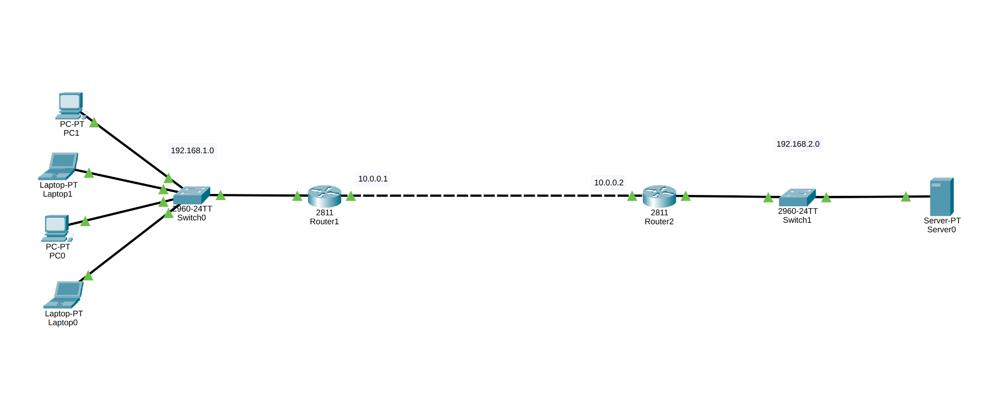
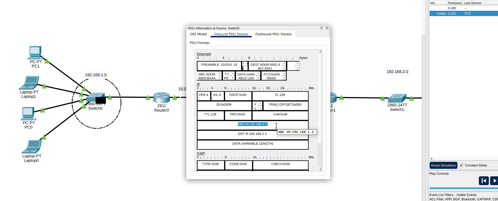
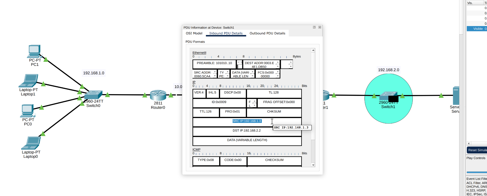
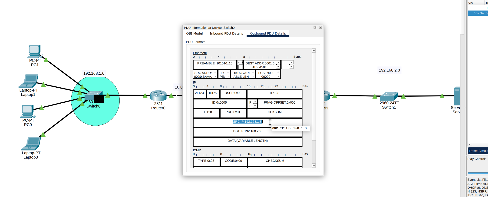
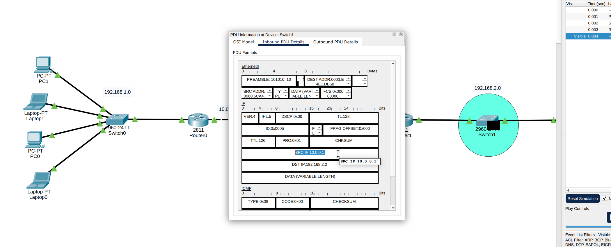

# Network Address Translation (NAT/PAT) Implementation

## 📌 Project Overview
This project demonstrates the configuration and deep packet inspection of **Port Address Translation (PAT)**, also known as **NAT Overload**, using Cisco Packet Tracer. The objective is to securely translate a private Local Area Network (LAN) to a single public IP address, allowing internal devices to communicate with external networks (simulated internet/server).

## 🏗️ Network Topology
The network consists of two routers connecting a private LAN to a remote server network:
* **Router 1 (NAT Gateway):** 
  * Inside Local Network: `192.168.1.0/24` (Hosts)
  * Outside Global IP: `10.0.0.1` (Public-facing interface)
* **Router 2 (Remote Network):** 
  * Remote Local Network: `192.168.2.0/24` (Contains the target Server at `192.168.2.2`)
  * Outside Global IP: `10.0.0.2`

> **Topology Reference:**
> 

## 🧪 Simulation, Testing & Deep Packet Inspection
To prove the functionality of the NAT configuration, traffic was analyzed using Packet Tracer's **Simulation Mode**. This allowed for the inspection of the ICMP Packet Data Units (PDUs) at different hops to observe the Source IP transformation.

### Phase 1: Pre-NAT Observation (Without Translation)
Before configuring NAT on Router 1, an ICMP ping was initiated from PC `192.168.1.2` to the Server `192.168.2.2`.
* **At Source Network (Switch 0):** The packet was inspected, showing the original private Source IP (`192.168.1.2`).
  > 
* **At Destination Network (Switch 1):** The packet arrived at the remote network still carrying the private Source IP (`192.168.1.2`), which is invalid for real-world internet routing.
  > 

### Phase 2: Post-NAT (PAT) Verification
After configuring NAT Overload (PAT) on Router 1 (defining the inside/outside interfaces and linking the ACL to the interface overload), the same ping test was conducted.
* **At Source Network (Switch 0):** The packet leaves the PC with the original private Source IP (`192.168.1.2`).
  > 
* **At Destination Network (Switch 1):** The packet was inspected after passing through Router 1. The Source IP was successfully translated to Router 1's public IP address (`10.0.0.1`). This confirms that PAT is actively translating private IPs to a public IP.
  > 

## 🛠️ Technologies & Protocols Used
* Cisco Packet Tracer (Simulation Mode & PDU Inspection)
* Network Address Translation (NAT) / Port Address Translation (PAT)
* Inside Local / Outside Global IP mapping
* IPv4 Private vs. Public Routing
* ICMP (Connectivity & Packet tracking)
